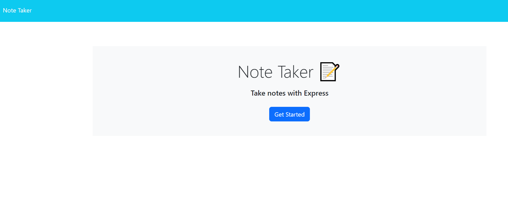
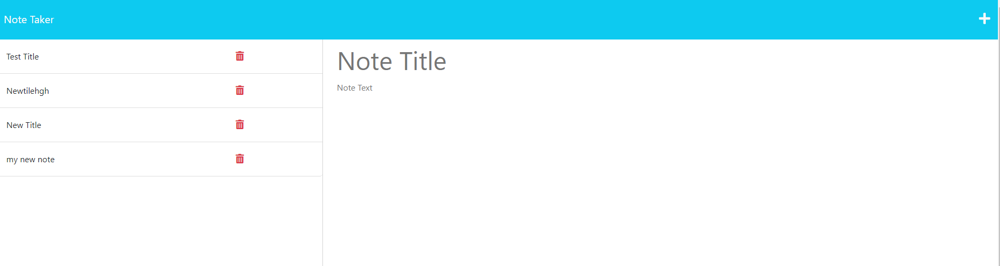
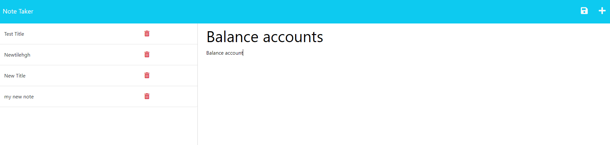
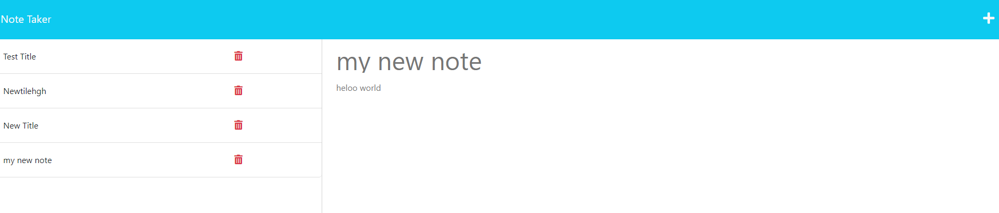

# Note-taker

```
The link for my deployed website can viewed here
https://shiby-note-taker-app.herokuapp.com/
```

## Description

```
This application called Note Taker that can be used to write and save notes. This application uses Express.js as a back-end, save and retrieve note data from a JSON file.It is deployed on Heroku.
```

## User Story

```
AS A small business owner
I WANT to be able to write and save notes
SO THAT I can organize my thoughts and keep track of tasks I need to complete
```

## Acceptance Criteria

```
GIVEN a note-taking application
WHEN I open the Note Taker
THEN I am presented with a landing page with a link to a notes page
WHEN I click on the link to the notes page
THEN I am presented with a page with existing notes listed in the left-hand column, plus empty fields to enter a new note title and the note’s text in the right-hand column
WHEN I enter a new note title and the note’s text
THEN a Save icon appears in the navigation at the top of the page
WHEN I click on the Save icon
THEN the new note I have entered is saved and appears in the left-hand column with the other existing notes
WHEN I click on an existing note in the list in the left-hand column
THEN that note appears in the right-hand column
WHEN I click on the Write icon in the navigation at the top of the page
THEN I am presented with empty fields to enter a new note title and the note’s text in the right-hand column
```

## Technologies Used

```
Node.js
Express.js
HTML
CSS
JavaScript
Json
```

## Mock-Up

The following images show the web application's appearance and functionality:







## Usage

 -  This app can be used to write and save notes.
 -  Provide empty fields to capture the new note’s title and text.
 -  All saved notes are displayed on the left-hand side.
 -  Once user has entered note's title and text,save button appears.
 -  User can delete any of the saved notes by clicking delete icon.
 -  Clicking on the title displays note on the right-hand side.
 -  Clicking on the write icon in the navigation at the top of the page, provides empty fields to enter new note's title and text.
 


### Resources

```
Course Material- Mini Project

```
